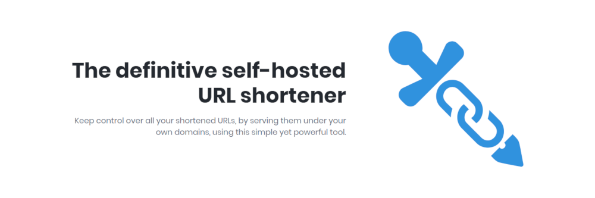

# Shlink CI/CD pipeline

Deploy Shlink server with CI/CD on Elestio

 
 

# Once deployed ...

You can open Shlink UI here:

    URL: https://[CI_CD_DOMAIN]:18081
    email: root
    password: [ADMIN_PASSWORD]

You can open Shlink API here:

    URL: https://[CI_CD_DOMAIN]/rest/v3/health

# API

For example, to list all URLs:

    curl -X GET \
    'https://[CI_CD_DOMAIN]/rest/v3/short-urls'\
    --header 'X-Api-Key: YOUR_API_KEY'

for more information: <a target="_blank" href="https://api-spec.shlink.io/">Shlink's api doc</a>

# API key

You can find your api key by going to Shlink UI, choose Main Server, then in the bottom left tab click on Edit this server
